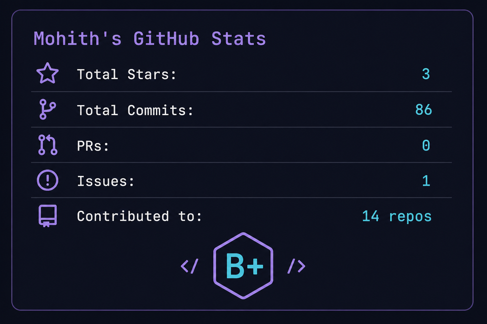
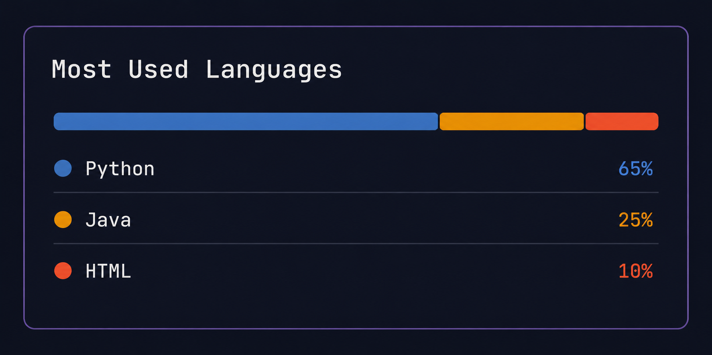
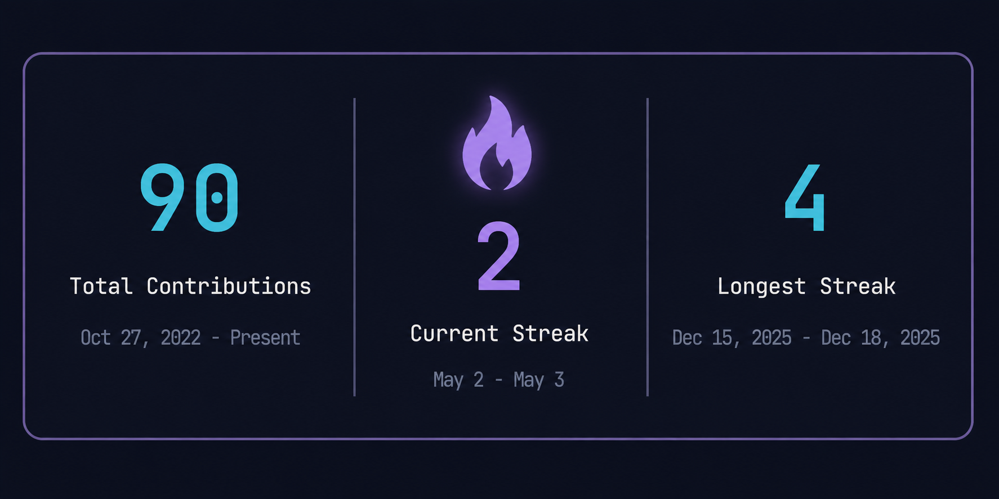

# I don't build apps. I build systems.

<div align="center">

```
Discipline forged in the Western Ghats. Sharpened at SRM. Deployed through code.
```

[](https://mohith535.github.io/portfolio/)
[](https://linkedin.com/in/mohith53)
[](https://instagram.com/mohith_kannan_53)
[](https://github.com/Mohith535)

</div>

---

## Who I Am

I'm **K Mohith Kannan** — a 2nd year B.Tech CSE (AI & ML) student at **SRMIST, Kattankulathur**, Chennai.

But before I was a developer, I was a cadet.

I spent 7 years at **Sainik School Amaravathinagar** — one of India's most rigorous residential institutions, established in 1962 under the Ministry of Defence, nestled at the foothills of the Western Ghats. Entrance was competitive. Life there was structured down to the minute. The motto: *"Can Do It."* You learned it, or you didn't survive.

That school didn't just teach academics. It installed a firmware — an internal operating system of discipline, resilience, and extreme ownership — that runs quietly beneath everything I build today.

Now at SRM, I'm loading the knowledge stack: AI, machine learning, systems design. I'm not here to graduate and get a job. I'm here to build what doesn't exist yet.

My north star is **entrepreneurship**. Every project I ship is a step toward it.

---

## What I'm Building

### ⚡ TaskFlow v8.0.0 — The Execution Engine for Deep Work

> *"Most task managers are passive lists. TaskFlow is an active execution system."*

TaskFlow is a CLI-first productivity framework that uses **behavioral psychology** to turn your task list into an execution machine. It is not a to-do app. It's a system engineered around how your brain actually works.

**Core mechanics rooted in research:**
- 🐸 **The One Frog Protocol** — One `[★ PRIME TARGET]` per day. Forces commitment using Cialdini's Consistency Principle
- 🔥 **Eisenhower Priority Engine** — 4 behavioral weight classes, not arbitrary 1–5 scales
- 🛡️ **Focus Protocol** — Multi-layered attention defense: visual lockdown, intentional friction, optional OS-level site blocking
- ⏱️ **Temporal Pressure System** — Deadlines change color and pulse as they approach — blue → amber → red
- 📥 **2-Second Capture** (`taskflow dump`) — NLP extracts priority, tags, deadlines instantly
- 🚨 **Recovery Mode** — Detects overload and forces triage when too many deadlines collapse

**Architecture:** CLI Router → Command Engine (3200+ lines) + Web HUD Server → Storage Layer (JSON + Atomic Writes) → Local Storage `~/.taskflow/`

**100% offline. Zero telemetry. Zero cloud. Your data stays on your machine.**

```bash
pip install --upgrade git+https://github.com/Mohith535/TaskFlow.git
taskflow dump "Build the future #startup !h"
taskflow prime 1
taskflow focus --id 1 --minutes 90
```

[](https://github.com/Mohith535/TaskFlow)
[](https://python.org)
[](https://github.com/Mohith535/TaskFlow/blob/main/LICENSE)

> TaskFlow isn't my end goal. It's **step one** of something much larger. ↓

---

## ◈ Project NOVA — *[CLASSIFIED]*

> *What if your AI didn't just respond to you — but knew you?*

I'm building toward an AI that is **emotionally intelligent** — one that senses how you feel, understands your intent, and proactively assists you like a real human companion, not just a tool.

Not another chatbot. Not another assistant.

**NOVA** will eventually build its own character — one shaped entirely by *you*. The longer it lives alongside you, the more it becomes a reflection of who you are. When interacting with other NOVA instances, it doesn't just represent a user. It *becomes* you.

The insight that drives this: a person who has been with you through every up and down knows you better than anyone. That's the relationship I'm building between human and AI.

TaskFlow is the first instrument in this orchestra. More are coming.

*The full vision stays behind closed doors — for now.*

---

## All Repositories

| Repository | What it does | Stack |
|---|---|---|
| [**TaskFlow**](https://github.com/Mohith535/TaskFlow) | CLI productivity framework with behavioral psychology engine, web HUD, focus sessions, NLP capture | Python |
| [**ai-grievance-bharat**](https://github.com/Mohith535/ai-grievance-bharat) | Unified AI-powered grievance platform for India — design, requirements & implementation | AI / Systems |
| [**advent-of-code-2025**](https://github.com/Mohith535/advent-of-code-2025) | My solutions to all 24 Advent of Code 2025 puzzles — algorithms, data structures, logic | Python |
| [**portfolio**](https://github.com/Mohith535/portfolio) | Personal portfolio site | HTML |
| [**OOPS-banner**](https://github.com/Mohith535/OOPS-banner) | Java project implementing OOP concepts — classes, functions, maps — to print in banner format | Java |
| [**week1and2practice**](https://github.com/Mohith535/week1and2practice) | Week 1 & 2 Java fundamentals: variables, operators, input, basic problem solving | Java |

---

## Skills & Stack

**Languages**


**AI & Data**


**Tools & Systems**


**Soft Skills** (forged at Sainik School, not listed on a resume)

`Extreme ownership` · `Stress management` · `Team leadership` · `Adaptability` · `Time discipline`

---

## Certifications

| Certificate | Issuer | Year |
|---|---|---|
| Introduction to Model Context Protocol | **Anthropic** | Mar 2026 |
| Ossome Hacks 3.0 — Idea Submission Round (ArmorIQ) | Unstop × SRMIST | Apr 2026 |
| GenAI Powered Data Analytics Job Simulation | **Tata × Forage** | Feb 2026 |
| GenAI Job Simulation | **BCG × Forage** | Feb 2026 |
| Data Analytics Job Simulation | **Deloitte Australia × Forage** | Feb 2026 |

---

## GitHub Stats

<div align="center">







</div>

---

## Education

🎓 **B.Tech CSE (Artificial Intelligence & Machine Learning)**
SRMIST, Kattankulathur, Chennai, Tamil Nadu · Apr 2025 – May 2029

🪖 **Higher Secondary — Science (PCM)**
Sainik School Amaravathinagar · Apr 2017 – Mar 2024
*Residential school under Ministry of Defence, Govt. of India. Motto: "Can Do It."*

---

## Beyond the Terminal

When I'm not building, I'm reading — psychology, human behavior, systems thinking. I play basketball. I study how people think before I study how machines think.

That's not a coincidence. Understanding humans is the prerequisite to building AI that actually serves them.

---

<div align="center">

*"Your mind is for having ideas, not holding them."*
*— David Allen*

**I don't just read quotes like this. I build systems around them.**

---

📬 Reach me: [LinkedIn](https://linkedin.com/in/mohith53) · [Portfolio](https://mohith535.github.io/portfolio/) · [Instagram](https://instagram.com/mohith_kannan_53)

</div>
